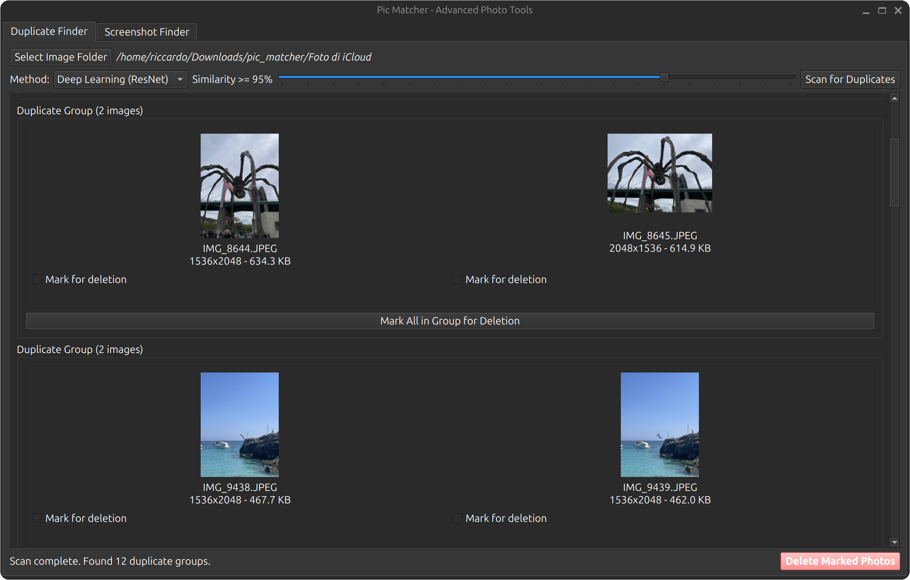

# Pic Matcher 

Pic Matcher is a desktop application which helps to organize and clean up your photo library from duplicates and screenshots.
<div align="center">
    
</div>

## Features

This application is divided into two main tools:

### 1. Duplicate Finder

This tool scans your photo library to find visually similar images and potential duplicates. It offers multiple advanced methods for comparison:

- **Perceptual Hashing (pHash, dHash, wHash):** These methods create a unique "fingerprint" of each image, allowing the app to find photos that are visually similar, even if they have been resized, slightly edited, or saved in a different format.
- **Deep Learning Comparison (ResNet):** This uses a state-of-the-art neural network to analyze the actual content of your photos. It can identify duplicates even if they are taken from different angles or have different lighting conditions.
- **Adjustable Threshold:** You can fine-tune the sensitivity of the duplicate detection for each method.
- **Multi-Select Deletion:** Mark one or more photos from a duplicate group to delete them.

### 2. Screenshot Finder

This tool is designed to specifically find and remove screenshots from your photo library. It uses an heuristic approach to identify screenshots based on their content:

- **Filename Analysis:** Instantly identifies files containing keywords like "screenshot".
- **Content-Based Detection:** For other files, it analyzes a combination of:
    - **Color Palette:** Checks for the simple, limited color schemes typical of user interfaces.
    - **Edge Density:** Looks for the high concentration of sharp, straight lines found in UIs and text.
    - **Aspect Ratio:** Considers common screen aspect ratios as a contributing factor.
- **Bulk Deletion:** Mark all the screenshots you want to remove and delete them with a single click.

## Setup and Installation

Follow these steps to run the application from the source code.

### 1. Create a Virtual Environment

It is highly recommended to run the application in a virtual environment. Navigate to the `pic_matcher_app` directory and run:

```bash
python3 -m venv venv
```

### 2. Activate the Environment

On Linux or macOS:
```bash
source venv/bin/activate
```

On Windows:
```bash
.\venv\Scripts\activate
```

### 3. Install Dependencies

Install all the required libraries from the `requirements.txt` file:

```bash
pip install -r requirements.txt
```

## How to Run

Once the setup is complete, you can run the application with the following command:

```bash
python main.py
```

<!-- ## How to Build a Standalone Executable

You can bundle the application into a single standalone executable using `PyInstaller`.

First, ensure `PyInstaller` is installed in your virtual environment:
```bash
pip install pyinstaller
```

Then, run the following command from within the `pic_matcher_app` directory:

```bash
pyinstaller --name PicMatcher --onefile --windowed main.py
```

This will create a `dist` folder containing the `PicMatcher` executable. You can distribute and run this file on other systems without needing to install Python or any dependencies. -->

